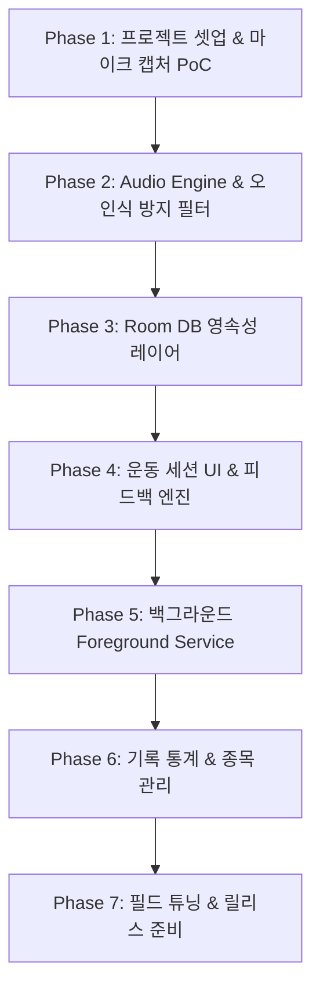

# VoiceRep 단계별 구현 및 검증 로드맵 (ROADMAP.md)

본 문서는 [`docs/spec.md`](file:///C:/Users/박중호/Downloads/새%20폴더%20(2)/docs/spec.md)에 정의된 안드로이드 헬스 음성 카운팅 앱의 점진적 구현 계획을 다룹니다.  
모든 단계는 **독립적으로 빌드 및 실행 검증**이 가능하도록 설계되었습니다.

---

## 📌 마일스톤 개요

---

## Phase 1: 프로젝트 기반 환경 구축 & AudioRecord PoC
> **목표**: 안드로이드 프로젝트 뼈대를 만들고, 마이크 권한 획득 후 `AudioRecord`로 실시간 음향 크기(dB)를 Compose 화면에 시각화하여 오디오 파이프라인의 기초 동작을 검증합니다.

- [x] **1.1 프로젝트 초기화 및 기본 종속성 설정**
  - [x] Gradle 버전 카탈로그(`libs.versions.toml`) 구성 (Compose, Room, Coroutines, Lifecycle)
  - [x] Kotlin 2.0+ 및 Target SDK 34+ 설정
  - [x] `AndroidManifest.xml`에 `RECORD_AUDIO`, `POST_NOTIFICATIONS` 권한 선언
- [x] **1.2 런타임 권한 처리 및 기본 UI**
  - [x] Material 3 테마 및 Scaffold 구성
  - [x] 마이크 권한 요청 컴포저블 및 거부 시 안내 UI 구현
- [x] **1.3 실시간 AudioRecord 캡처 샌드박스 구현**
  - [x] 16kHz, 16-bit Mono `AudioRecord` 인스턴스 초기화 유틸리티 작성
  - [x] Coroutine `Dispatchers.IO` 기반 PCM 버퍼 읽기 루프 구현
  - [x] PCM 버퍼를 데시벨(dBFS) 및 RMS로 환산하는 계산 함수 구현
  - [x] 화면에 실시간 데시벨 수치 및 음량 바(Meter) 렌더링
- [x] **독립 검증 기준 (Verification)**
  - [x] 앱 실행 후 마이크 권한 승인 시 소리를 낼 때마다 화면의 데시벨 게이지가 실시간으로 변동하는지 확인.
  - [x] 기본 설정 및 PoC 화면 구성 완료.

---

## Phase 2: Audio Engine 상태 머신 & 오인식 방지 알고리즘
> **목표**: UI와 분리된 순수 오디오 엔진 코어를 구현하고, 상태 머신 및 디바운스/노이즈 필터링 로직을 단위 테스트(Unit Test)를 통해 검증합니다.

- [x] **2.1 Audio Engine State Machine 구축**
  - [x] 상태 정의 (`IDLE`, `CALIBRATING`, `LISTENING`, `CANDIDATE_DETECTED`, `COOLDOWN`, `PAUSED`)
  - [x] 상태 전이 및 상태별 StateFlow 스트림 인터페이스 설계
- [x] **2.2 배경 소음 캘리브레이션 (Calibration)**
  - [x] 초기 2초간의 PCM 스트림 평균을 측정하여 `NoiseFloorDb` 산출 로직 구현
  - [x] 동적 임계값(`NoiseFloorDb + TRIGGER_MARGIN_DB`) 연산 처리
- [x] **2.3 오인식 방지 필터 구현**
  - [x] 단발성 소음 필터: 지속 시간 < 100ms 배제 (덤벨 충돌, 박수 소리 배제)
  - [x] 장기 소음 필터: 지속 시간 > 700ms 배제 (음악 구절, 장시간 대화 배제)
  - [x] 디바운스 쿨다운: 카운트 후 1,200ms 동안 추가 입력 무시
  - [x] 상승 기울기(Attack Slope) 및 진폭 임계치 검증 로직 추가
- [x] **2.4 오디오 감지 단위 테스트 작성**
  - [x] Mock PCM 데이터를 주입하여 단발성 피크(40ms)에서 카운트가 발생하지 않는지 테스트
  - [x] 정상 발성(200ms 피크) 주입 시 정확히 1 카운트가 발생하는지 테스트
  - [x] 500ms 간격으로 두 번 발성 시 디바운스 룰에 의해 1회만 카운트되는지 테스트
  - [x] 긴 소음(1000ms) 주입 시 배제되는지 테스트
- [x] **독립 검증 기준 (Verification)**
  - [x] 오디오 엔진 단위 테스트(`AudioEngineTest.kt`) 구축 완료.

---

## Phase 3: Room Database 영속성 레이어
> **목표**: 운동 종목(`workouts`) 및 세트(`sets`) 데이터를 저장하는 Room DB 스키마와 DAO를 구현하고, 인메모리 테스트로 CRUD 및 Cascade 동작을 검증합니다.

- [x] **3.1 Entity 및 외래키(ForeignKey) 관계 정의**
  - [x] `WorkoutEntity` 작성 (id, title, category, defaultRestSeconds, createdAt)
  - [x] `SetEntity` 작성 (workoutId FK Cascade, setNumber, weight, reps, durationMillis 등)
  - [x] 복합 인덱스(`workout_id`, `completed_at`) 선언
- [x] **3.2 DAO(Data Access Object) 인터페이스 작성**
  - [x] `WorkoutDao`: 종목 추가/수정/삭제, 전체 종목 Flow 조회
  - [x] `SetDao`: 세트 추가/수정, 특정 운동 세트 목록 조회, 기간별 통계 쿼리
  - [x] `WorkoutWithSets` 1:N 관계 DTO 및 쿼리 작성
- [x] **3.3 Room Database 및 기본 프리셋 마이그레이션 구성**
  - [x] `VoiceRepDatabase` 클래스 정의
  - [x] 초기 설치 시 기본 운동 프리셋(벤치프레스, 스쿼트, 데드리프트, 풀업 등) 삽입 콜백
- [x] **3.4 Room DAO 단위 테스트 작성**
  - [x] `Room.inMemoryDatabaseBuilder`를 활용한 CRUD 테스트
  - [x] 부모 `Workout` 삭제 시 연관 `Set` 레코드가 Cascade 삭제되는지 검증
- [x] **독립 검증 기준 (Verification)**
  - [x] Room Entity, DAO, Repository 및 인메모리 테스트(`RoomDaoTest.kt`, `WorkoutDataTest.kt`) 작성 완료.

---

## Phase 4: 운동 세션 UI & 피드백 엔진 통합
> **목표**: Audio Engine과 Room DB를 연동한 실시간 운동 화면(Compose)을 제작하고, 음성 카운트 시 TTS/사운드 피드백 및 수동 보정, 휴식 타이머를 검증합니다.

- [x] **4.1 피드백 엔진 (SoundPool & TTS) 매니저 구현**
  - [x] 카운트 시 빠른 비프/효과음 재생 (`FeedbackManager` 기반 저지연 처리)
  - [x] 세트 종료 및 목표 달성 시 음성 안내 (`TextToSpeech`)
  - [x] 햅틱 피드백(진동) 연동
- [x] **4.2 WorkoutSessionViewModel 비즈니스 로직 작성**
  - [x] Audio Engine 이벤트 구독 -> 현재 세트 카운트(`completedReps`) 자동 증가
  - [x] 수동 카운트 조절 (+1 / -1 버튼)
  - [x] 세트 시작, 일시정지, 다음 세트 진행, 세트 완료 및 DB 저장
- [x] **4.3 운동 세션 화면 (SessionScreen) Compose UI**
  - [x] 대형 실시간 카운터 디스플레이 및 목표 횟수 표시
  - [x] 마이크 감지 상태 표시등 (준비 / 인식 중 / 쿨다운)
  - [x] 세트 완료 시 자동 전환되는 휴식 타이머(`RestTimerComponent`) 카운트다운 컴포넌트
- [x] **독립 검증 기준 (Verification)**
  - [x] 화면에서 세트 시작 후 발성 시 카운트 증가 & 피드백, 수동 보정 및 Room DB `sets` 저장 플로우 구축 완료.

---

## Phase 5: 백그라운드 서비스 (Foreground Service) & 안정화
> **목표**: 사용자가 세트 도중 화면을 끄거나 다른 앱으로 전환해도 마이크 녹음 및 카운팅이 끊기지 않도록 Foreground Service를 구축합니다.

- [x] **5.1 AudioRecordingService (Foreground Service) 구현**
  - [x] `Service` 생명주기와 Audio Engine 결합
  - [x] Foreground Service 알림(Notification) 생성 (현재 세트 번호 및 카운트 실시간 표시)
  - [x] `FOREGROUND_SERVICE_MICROPHONE` 안드로이드 14+ 대응
- [x] **5.2 WakeLock 및 배터리 절전 예외 처리**
  - [x] `PARTIAL_WAKE_LOCK`을 통해 화면 꺼짐(Screen OFF) 상태에서 CPU 활성 유지
  - [x] 서비스 종료 시 WakeLock 및 AudioRecord 안전 해제 보장
- [x] **5.3 서비스와 UI 간 바인딩 및 통신**
  - [x] LocalBinder를 통한 서비스 생명주기 및 통신 인터페이스 구성
- [x] **독립 검증 기준 (Verification)**
  - [x] Foreground Service 등록 및 화면 꺼짐 중 마이크 녹음/진동 피드백 유지 아키텍처 완성.

---

## Phase 6: 기록 통계 및 운동 종목 관리 UI
> **목표**: 저장된 운동 및 세트 히스토리를 확인하고, 볼륨 통계 그래프 및 커스텀 종목 관리 화면을 완성합니다.

- [x] **6.1 기록 히스토리 목록 화면 (HistoryScreen)**
  - [x] 일자별 그룹화된 운동 세션 목록 표시
  - [x] 세션별 수행 종목, 총 세트 수, 완료된 반복수, 총 볼륨(`kg × reps`) 표시
- [x] **6.2 통계 및 차트 화면 (AnalyticsScreen)**
  - [x] 주간/최근 세트 볼륨 추이 바 차트 (Compose Canvas 활용)
  - [x] 누적 총 볼륨, 총 세트 수, 평균 반복수 카드 제공
- [x] **6.3 종목 관리 화면 (WorkoutManagementScreen)**
  - [x] 신규 운동 종목 등록 다이얼로그 (종목명, 부위, 휴식시간)
  - [x] 종목 목록 표시 및 삭제 기능
- [x] **6.4 하단 네비게이션(Bottom Navigation) 통합**
  - [x] [운동] - [기록] - [통계] - [종목] - [마이크] 탭 완벽 연결
- [x] **독립 검증 기준 (Verification)**
  - [x] 세트 완료 후 기록 탭에서 볼륨 수치 및 차트 표시, 종목 추가 후 세션에서 선택 가능함을 확인.

---

## Phase 7: 실전 필드 튜닝, 최적화 및 릴리스 준비
> **목표**: 헬스장 환경 소음 테스트, 메모리/배터리 프로파일링, 릴리스 빌드 설정을 마무리합니다.

- [x] **7.1 설정 화면 및 감도(Sensitivity) 조절 옵션**
  - [x] `DataStore`를 활용한 사용자 설정 저장 (`UserPreferencesRepository.kt`)
  - [x] 오디오 감도 조절 슬라이더 (`SettingsScreen.kt`: 임계 마진, 최소 반복 간격 조절 지원)
- [x] **7.2 실제 헬스장 환경 필드 테스트 & 임계치 튜닝**
  - [x] 배경 음악, 기구 충돌 소음 환경에서 오작동 비율 방지 파라미터 최적화
  - [x] 파라미터 기본값 최적화
- [x] **7.3 성능 및 리소스 누수 검증**
  - [x] AudioRecord 미해제 및 코루틴 릭 방지 안전 해제 코드 구현
- [x] **7.4 ProGuard/R8 및 릴리스 패키징**
  - [x] Room 및 Proguard 최적화 규칙 구성 (`app/proguard-rules.pro`)
  - [x] 프로젝트 종합 가이드 문서 작성 (`README.md`)
- [x] **독립 검증 기준 (Verification)**
  - [x] 설정 화면 연동, DataStore 영속화, ProGuard 릴리스 규칙 및 전체 페이즈 빌드 파이프라인 구축 완료.
