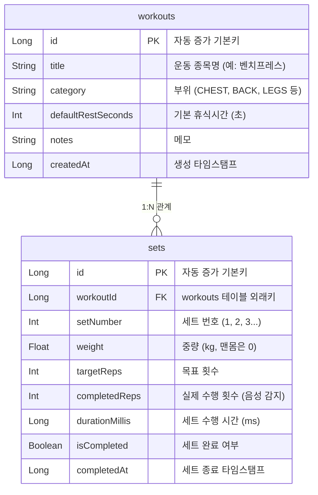
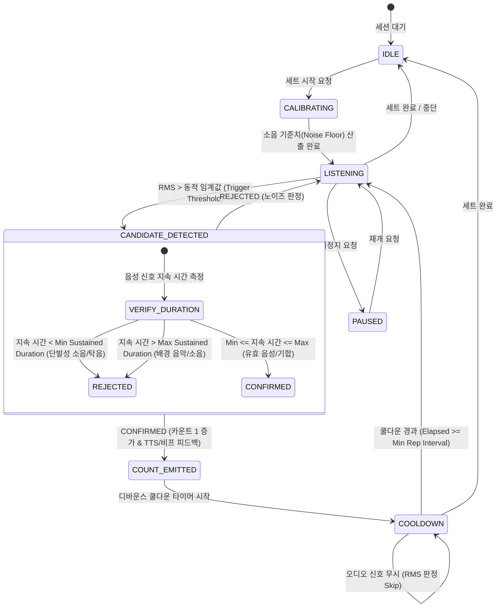

# 안드로이드 헬스 음성 카운팅 앱 (VoiceRep) 기능 및 기술 명세서

---

## 1. 프로젝트 개요 (Overview)

**VoiceRep**은 헬스(웨이트 트레이닝) 중 사용자가 기기를 직접 조작하지 않고도 음성(기합, 호흡음, 숫자 발성 등)을 통해 자동으로 반복 횟수(Reps)를 카운팅하고 운동 세트와 기록을 체계적으로 관리해주는 스마트 피트니스 어시스턴트 애플리케이션입니다.

---

## 2. 앱 핵심 기능 정의 (Core Features)

### 2.1 마이크 음성 감지 (Voice & Audio Sensing)
* **실시간 오디오 스트리밍 캡처**: Android `AudioRecord` API를 활용하여 16kHz/16-bit Mono PCM 데이터를 버퍼 단위로 실시간 수집.
* **음향 에너지(RMS) 및 피크 감지**: 실시간 PCM 버퍼의 데시벨(dBFS) 및 RMS(Root Mean Square) 에너지를 계산하여 순간적인 에너지 급증 감지.
* **주변 소음 적응형 보정(Dynamic Noise Floor Calibration)**:
  * 운동 시작 전 2~3초간 주변 헬스장 소음(음악, 덤벨 충돌음 등)을 측정하여 기준치(Noise Floor) 자동 설정.
  * 운동 중에도 지속적으로 Moving Average를 통해 배경 소음의 변동을 추적.
* **주파수 밴드 필터링 (Voice Bandpass Filter)**: 사람의 음성 대역(약 300Hz ~ 3,400Hz) 외의 저주파 쿵쾅거림(머신 진동)이나 고주파 쇳소리를 감쇠.

### 2.2 디바운스 룰 및 오인식 방지 (Debounce & False-Positive Prevention)
* **연속 발성 및 중복 카운트 방지 (Debounce Cooldown)**:
  * 한 번 카운트가 인식되면 최소 반복 동작 소요 시간(기본값 1,000ms) 동안 재트리거 방지.
* **단발성 충돌 소음 필터 (Duration Window Filter)**:
  * 덤벨 내려놓는 소리 등 순간적인 충돌음(10~50ms 미만)은 카운트 대상에서 제외.
  * 최소 음성 지속 시간(예: 80ms ~ 600ms)을 충족해야 유효 트리거로 인정.
* **거친 숨소리 및 호기음 필터 (Heavy Breathing Filter)**:
  * 점진적으로 커지는 호흡음과 폭발적인 발성(기합, 카운트 구호)의 상승 기울기(Attack Envelope / Energy Slope) 비교.

### 2.3 운동 세트 관리 (Workout & Set Management)
* **운동 세션 제어**:
  * 운동 종목 선택 (벤치프레스, 스쿼트, 데드리프트, 풀업 등 기본 프리셋 및 커스텀 종목 지원).
  * 세트 시작 / 일시정지 / 종료 플로우.
* **자동/수동 카운팅 보정**:
  * 음성 감지 시 실시간 카운트 증가 + 오디오 피드백 (TTS 또는 비프음/햅틱 진동).
  * 화면 탭을 통한 수동 +1 / -1 즉시 보정 지원.
* **휴식 타이머 (Rest Timer)**:
  * 세트 완료 시 사전에 정의된 휴식 시간(예: 60초, 90초) 자동 카운트다운.
  * 휴식 종료 5초 전 비프음 및 종료 알림.
* **백그라운드 세션 유지 (Foreground Service)**:
  * 화면이 꺼지거나 다른 앱(음악 스트리밍 등)을 사용하는 동안에도 마이크 캡처 및 카운팅 유지.

### 2.4 기록 및 통계 (Workout Analytics & History)
* **세션 히스토리**: 일자별, 운동 종목별 세트 수, 반복 수, 중량(kg), 운동 소요 시간 기록.
* **총 볼륨(Volume) 자동 계산**: 세트별 `중량(kg) × 반복수(reps)` 합산 산출.
* **통계 시각화**: 주간/월간 총 볼륨 추이, 종목별 최고 중량(1RM 추정치) 및 빈도 그래프 제공.

---

## 3. 기술 스택 (Tech Stack)

| 영역 | 기술 / 라이브러리 | 선정 사유 |
| :--- | :--- | :--- |
| **Language** | Kotlin 2.0+ | 최신 코루틴 및 널 안전성 지원 |
| **UI Framework** | Jetpack Compose (Material 3) | 반응형 선언형 UI, 실시간 오디오 파형 및 카운트 애니메이션 구현 용이 |
| **Architecture** | Modern Android Architecture (MVVM + Clean Architecture) | UI, 비즈니스 로직(Audio Engine), 데이터 레이어 분리 |
| **Database** | Room DB (SQLite) | 세트/운동 데이터의 관계형 구조 저장 및 Flow를 통한 반응형 데이터 스트림 |
| **Audio Processing** | Android Native `AudioRecord` | 저지연(Low Latency) Raw PCM 버퍼 수집 및 커스텀 오디오 분석 최적화 |
| **Feedback Engine** | TextToSpeech (TTS) & SoundPool | 가벼운 카운트 효과음 재생 및 목표 달성 안내 |
| **Concurrency** | Kotlin Coroutines & Flow | 오디오 스트림 비동기 수집, 디바운스 타이머, 백그라운드 I/O 처리 |
| **Background** | Foreground Service & WakeLock | 화면 꺼짐 상태에서도 지속적인 마이크 캡처 보장 |
| **권한 관리** | Accompanist Permissions / AndroidX Activity Result | `RECORD_AUDIO`, `POST_NOTIFICATIONS` 런타임 권한 처리 |

---

## 4. Room DB 테이블 명세 (Database Schema)

### 4.1 ER 다이어그램 (ERD)



### 4.2 테이블 상세 명세

#### (1) `workouts` 테이블
운동 종목 및 메타 정보를 관리합니다.

| 컬럼명 | 데이터 타입 | Nullable | 기본값 | 제약조건 / 설명 |
| :--- | :--- | :---: | :--- | :--- |
| `id` | `INTEGER (Long)` | NO | Auto-Increment | PRIMARY KEY |
| `title` | `TEXT` | NO | - | 운동 종목명 (예: "스쿼트", "바벨 로우") |
| `category` | `TEXT` | NO | 'CUSTOM' | 운동 부위 (CHEST, BACK, LEGS, SHOULDERS, ARMS, CORE, CUSTOM) |
| `default_rest_seconds` | `INTEGER` | NO | 60 | 권장 휴식 시간 (초) |
| `notes` | `TEXT` | YES | NULL | 운동 관련 메모 또는 큐 |
| `created_at` | `INTEGER (Long)` | NO | System.currentTimeMillis() | 생성 일시 (Epoch Millis) |

#### (2) `sets` 테이블
특정 운동 세션 내 각 세트별 실제 수행 데이터를 기록합니다.

| 컬럼명 | 데이터 타입 | Nullable | 기본값 | 제약조건 / 설명 |
| :--- | :--- | :---: | :--- | :--- |
| `id` | `INTEGER (Long)` | NO | Auto-Increment | PRIMARY KEY |
| `workout_id` | `INTEGER (Long)` | NO | - | FOREIGN KEY (`workouts.id`) ON DELETE CASCADE |
| `set_number` | `INTEGER` | NO | 1 | 세트 번호 (1st set, 2nd set...) |
| `weight` | `REAL (Float)` | NO | 0.0 | 운동 중량 (kg) |
| `target_reps` | `INTEGER` | NO | 10 | 목표 횟수 |
| `completed_reps` | `INTEGER` | NO | 0 | 음성 및 수동으로 기록된 최종 반복 횟수 |
| `duration_millis` | `INTEGER (Long)` | NO | 0 | 세트 시작부터 종료까지 소요 시간 (ms) |
| `is_completed` | `INTEGER (Boolean)` | NO | 0 | 세트 정상 완료 여부 (1: 완료, 0: 진행중/취소) |
| `completed_at` | `INTEGER (Long)` | YES | NULL | 세트 완료 일시 (Epoch Millis) |

> **인덱스(Index) 설정**:
> * `idx_sets_workout_id`: `sets(workout_id)` 외래키 조회 속도 최적화
> * `idx_sets_completed_at`: 날짜별 기록 통계 쿼리 최적화

### 4.3 Kotlin Entity & 관계 정의 예시

```kotlin
@Entity(tableName = "workouts")
data class WorkoutEntity(
    @PrimaryKey(autoGenerate = true) val id: Long = 0,
    val title: String,
    val category: String,
    @ColumnInfo(name = "default_rest_seconds") val defaultRestSeconds: Int = 60,
    val notes: String? = null,
    @ColumnInfo(name = "created_at") val createdAt: Long = System.currentTimeMillis()
)

@Entity(
    tableName = "sets",
    foreignKeys = [
        ForeignKey(
            entity = WorkoutEntity::class,
            parentColumns = ["id"],
            childColumns = ["workout_id"],
            onDelete = ForeignKey.CASCADE
        )
    ],
    indices = [
        Index(value = ["workout_id"]),
        Index(value = ["completed_at"])
    ]
)
data class SetEntity(
    @PrimaryKey(autoGenerate = true) val id: Long = 0,
    @ColumnInfo(name = "workout_id") val workoutId: Long,
    @ColumnInfo(name = "set_number") val setNumber: Int,
    val weight: Float = 0.0f,
    @ColumnInfo(name = "target_reps") val targetReps: Int = 10,
    @ColumnInfo(name = "completed_reps") val completedReps: Int = 0,
    @ColumnInfo(name = "duration_millis") val durationMillis: Long = 0L,
    @ColumnInfo(name = "is_completed") val isCompleted: Boolean = false,
    @ColumnInfo(name = "completed_at") val completedAt: Long? = null
)
```

---

## 5. Audio Engine 상태 다이어그램 및 오인식 방지 파라미터

### 5.1 오디오 엔진 상태 다이어그램 (Audio State Transition)



### 5.2 오인식 방지 알고리즘 파라미터 규격

오디오 엔진은 실시간 PCM 샘플을 20ms~50ms 윈도우 단위로 분할하여 특성을 분석합니다.

| 파라미터명 | 기본 권장값 | 허용 범위 | 상세 기능 및 역할 |
| :--- | :--- | :--- | :--- |
| **`SAMPLE_RATE`** | `16,000 Hz` | 16kHz / 44.1kHz | 음성 대역 분석에 최적화된 샘플링 레이트 (연산량 최소화) |
| **`BUFFER_SIZE_MS`** | `40 ms` | 20ms ~ 50ms | 1회 분석 윈도우 크기 (16kHz 기준 640 Samples) |
| **`CALIBRATION_TIME`** | `2,000 ms` | 1,500ms ~ 3,000ms | 세트 시작 직후 주변 배경 소음(Noise Floor) 평균 측정 시간 |
| **`TRIGGER_MARGIN_DB`** | `+14 dB` | +10dB ~ +22dB | Noise Floor 대비 순간 RMS가 넘어야 하는 상대 임계값 |
| **`MIN_SUSTAINED_MS`** | `100 ms` | 60ms ~ 150ms | **순간 충돌음 필터링**: 쇠 부딪히는 소리, 박수 소리 등 단발성 피크 배제 |
| **`MAX_SUSTAINED_MS`** | `700 ms` | 500ms ~ 1,000ms | **장기 소음 필터링**: 긴 대화, 음악 구절, 지속적인 머신 소음 배제 |
| **`MIN_REP_INTERVAL_MS`** (Debounce) | `1,200 ms` | 800ms ~ 2,500ms | **최소 반복 간격**: 인간의 1회 수축/이완 최소 주기 미만에서 발생하는 거친 숨소리나 연속 발성 무시 |
| **`ATTACK_SLOPE_THRESHOLD`** | `0.4 dB/ms` | 0.2 ~ 0.8 dB/ms | **호흡음 분리**: 서서히 내쉬는 숨소리와 폭발적인 기합("흡!", "원!", "하!")의 에너지 급상승도(Attack) 비교 |

### 5.3 파라미터 판정 로직 의사코드 (Pseudocode)

```kotlin
fun processAudioFrame(buffer: ShortArray, noiseFloorDb: Double): AudioEvent? {
    val currentRmsDb = calculateRmsInDb(buffer)
    val currentTime = System.currentTimeMillis()

    // 1. 디바운스 쿨다운 체크
    if (currentTime - lastCountTimestamp < MIN_REP_INTERVAL_MS) {
        return null // 쿨다운 중 무시
    }

    // 2. 임계값(Threshold) 초과 여부 확인
    val dynamicThreshold = noiseFloorDb + TRIGGER_MARGIN_DB
    if (currentRmsDb > dynamicThreshold) {
        if (voiceStartTimestamp == 0L) {
            voiceStartTimestamp = currentTime
            peakRmsDb = currentRmsDb
        } else {
            peakRmsDb = maxOf(peakRmsDb, currentRmsDb)
        }
    } else {
        // 소리가 임계치 아래로 떨어진 순간 지속 시간 검증
        if (voiceStartTimestamp != 0L) {
            val duration = currentTime - voiceStartTimestamp
            voiceStartTimestamp = 0L

            // 3. 지속 시간 필터 (충돌음 및 배경음 배제)
            if (duration in MIN_SUSTAINED_MS..MAX_SUSTAINED_MS) {
                lastCountTimestamp = currentTime
                return AudioEvent.CountTriggered(
                    repDuration = duration,
                    peakEnergy = peakRmsDb
                )
            }
        }
    }
    return null
}
```

---

## 6. 향후 확장 고려사항 (Future Roadmap)
1. **On-Device Keyword Spotting (KWS)**: 단순 음량(RMS) 기반에서 텐서플로우 라이트(TFLite) 초경량 모델을 도입하여 "하나", "둘", "Up" 등의 구체적인 명령 구호 인식 고도화.
2. **Wear OS 연동**: 스마트워치 가속도계/자이로 센서와 음성 감지를 결합하여 렙 카운팅 정확도 99% 달성.
3. **Bluetooth 이어폰 마이크 지원**: 에어팟, 갤럭시 버즈의 마이크 채널을 Foreground 서비스로 라우팅하여 소음이 심한 환경에서도 선명한 발성 수집.
